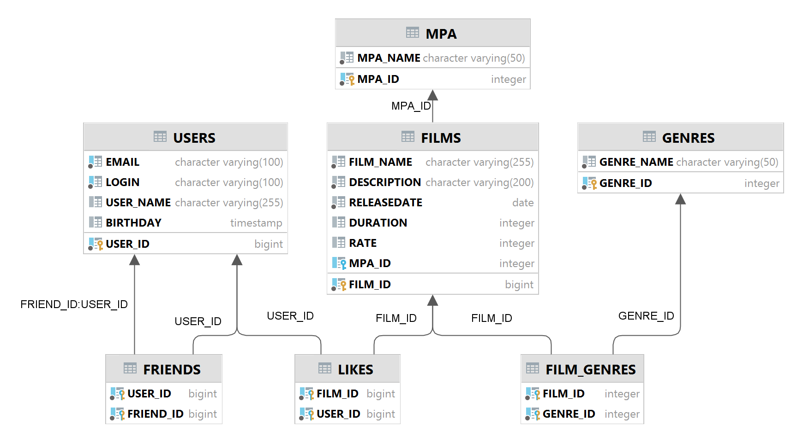

# java-filmorate
Template repository for Filmorate project.

Queries for basic operations:
1. films
    - getAll()
        - SELECT * FROM films AS f LEFT JOIN mpa AS m ON f.film_id = m.film_id;
    - getById(filmId)
        - SELECT * FROM films AS f LEFT JOIN mpa AS m ON f.film_id = m.film_id WHERE f.film_id = filmId;
2. users
    - getAll()
        - SELECT * FROM users;
    - getById(userId)
        - SELECT * FROM users WHERE user_id = userId;